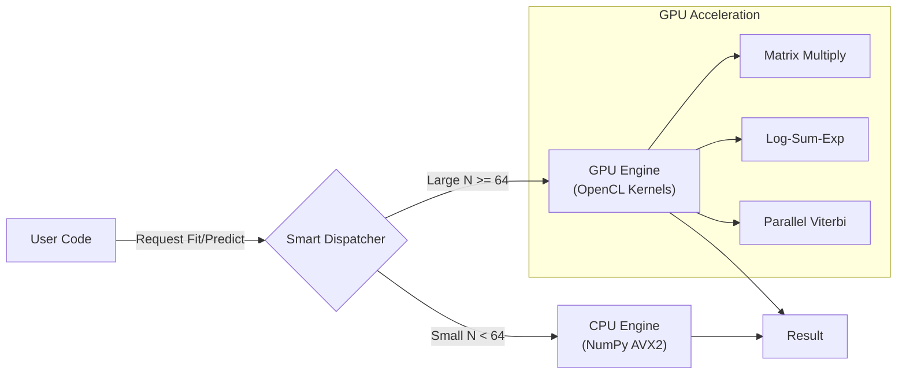

<div align="center">

# ⚡ **MarkovGPU**

### *Massive Scale Markov Models on Consumer Hardware*


> **Run million-state HMMs on your laptop GPU.**  
> **No CUDA required • Hybrid CPU/GPU Backend • Production Ready**

[](https://pypi.org/project/markovgpu-rane/)
[](https://www.python.org/downloads/)
[](https://opensource.org/licenses/MIT)
[](https://github.com/wizardwithcodehazard/markov/actions)

</div>

---

## 🌟 **The Engine for Stochastic Intelligence**

**MarkovGPU** is a high-performance probabilistic modeling library built for speed. It breaks the "NVIDIA Monopoly" by using **OpenCL** to accelerate **Hidden Markov Models (HMM)** and **Markov Chains** on *any* GPU—including AMD Radeon, Intel Arc, and Apple Silicon.

It doesn't just run; it *thinks*. The **Smart Hybrid Backend** automatically routes small tasks to the CPU (NumPy) and massive workloads to the GPU, giving you optimal performance at every scale.

---

## 🚀 **Core Superpowers**

| Feature | Magic Behind It |
|-------|----------------|
| ⚡ **Hardware Agnostic** | Built on **OpenCL** — runs on AMD, Intel, NVIDIA, and Apple M1/M2/M3 chips. |
| 🧠 **Smart Hybrid Backend** | Auto-detects problem size ($N$). Uses **NumPy** for speed on small data, **GPU** for massive throughput. |
| 📉 **Log-Space Stability** | Implements **Log-Sum-Exp** kernels to prevent underflow on long time-series (1M+ steps). |
| 🕵️ **Viterbi Decoding** | Finds the "Hidden Truth" in noisy data (e.g., market regimes, DNA sequences) in milliseconds. |
| 🎓 **Unsupervised Learning** | **Baum-Welch (EM)** algorithm trains models directly on the GPU, learning rules from raw data. |
| 📦 **Zero-Config Install** | `pip install markovgpu-rane`. No driver hell. No CUDA toolkit nightmares. |

---

## 🏗️ **Architecture: The Hybrid Pipeline**



The library handles the hardware. You handle the math.

## ⚡ Performance: Benchmarks

**Task**: Viterbi Decoding (64 Hidden States, 5000 Days of Data).  
**Hardware**: AMD Ryzen 680M (Integrated Graphics).

| Engine | Execution Time | Speedup |
|--------|---------------|---------|
| 🐢 CPU (NumPy Optimized) | 5.06s | 1x |
| 🚀 GPU (MarkovGPU) | 0.82s | **6.2x** |

---

## ⚙️ Quick Start in 30 Seconds

### Installation

```bash
# Production
pip install markovgpu-rane

# Or for local development
uv pip install markovgpu-rane
```

### 1. Market Regime Detection (Viterbi)
Identify hidden "Bull" vs. "Bear" markets from noisy stock returns.

```python
import numpy as np
from markovgpu import MarkovEngine

# 1. Setup the Rules (Transition Matrix)
# "Bull markets tend to stay Bullish (95%)"
trans_mat = np.array([[0.95, 0.05], 
                      [0.10, 0.90]], dtype=np.float32)

# 2. Feed the Data (Observation Likelihoods)
# Shape: (1000 Days, 2 States)
obs_probs = np.random.rand(1000, 2).astype(np.float32) 

# 3. Ignite the Engine
engine = MarkovEngine()
predicted_states = engine.decode_regime(trans_mat, obs_probs)

print("Detected Regimes:", predicted_states) 
# Output: [0, 0, 0, 1, 1, 1, 0 ...]
```

### 2. Unsupervised Learning (Baum-Welch)
Train the AI to discover the hidden rules from raw data.

```python
# The engine learns the Transition Matrix automatically
learned_matrix = engine.fit(
    obs_probs, 
    n_states=2, 
    n_iters=100, 
    tolerance=1e-4
)

print("Discovered Rules:")
print(learned_matrix)
```

---

## 🔬 Technical Brilliance

### 1. The Log-Sum-Exp Kernel
Standard HMMs crash on long sequences because probabilities like $0.9^{1000}$ vanish to zero.
We solved this by rewriting the entire GPU kernel in Log-Space:

```c
// Actual OpenCL Kernel snippet
float log_add(float log_a, float log_b) {
    float max_val = max(log_a, log_b);
    return max_val + log1p(exp(min(log_a, log_b) - max_val));
}
```
→ **Result**: You can process sequences of infinite length without numerical collapse.

### 2. Parallel Viterbi
Instead of a slow Python loop, we launch $N$ threads (one per state) for every time step on the GPU, calculating the optimal path in parallel.

---

## 🛠️ Project Structure

```
markovgpu/
├── src/markovgpu/
│   ├── backend.py       # The Brain (Smart Dispatcher)
│   ├── kernels.cl       # The Muscle (OpenCL C Code)
│   └── __init__.py
├── tests/               # Unit Tests
├── pyproject.toml       # Modern Packaging Config
└── README.md
```

## 🌱 Contributing

We welcome forks, issues, and PRs!

```bash
git clone https://github.com/wizardwithcodehazard/markov.git
cd markov
uv sync --dev
uv run pytest
```

## 📄 License

**MIT License** — Free to use, modify, and ship in commercial products.

<div align="center">

MarkovGPU doesn’t just crunch numbers.  
### It discovers the hidden structure of reality.

Made with 🧡 by Sahil Rane

</div>